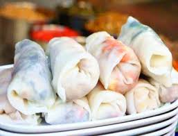
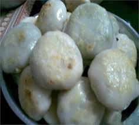
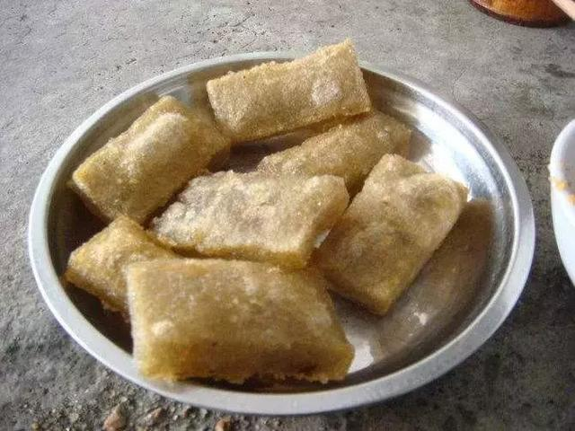
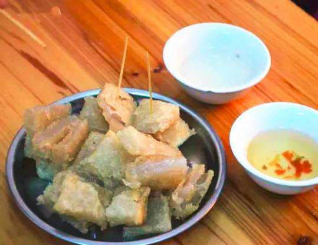

# awesome-eating
There are a great good deal of delicious snacks all over the world. Some snacks are very famous. But some snacks are little known. This repository is aimed to collect delicious and special snacks from all over the world ! To satisfy the strong desire of eating for every single foodies.

Your contributions are always welcome!

# eating !
- Name: Kunban(捆粄)
- location: Fengshun(county), Meizhou(city), Guangdong(province), China
- Picture：

---
- Name: Kunban(菜粄)
- location: Fengshun(county), Meizhou(city), Guangdong(province), China
- Picture：
  
---
- Name: Poyou Dougan(婆油豆干)
- location: Fengshun(county), Meizhou(city), Guangdong(province), China
- Picture：

---
- Name: Taoban(桃粄)
- location: Fengshun(county), Meizhou(city), Guangdong(province), China
- Picture：

---
- Name: Taoban(碗子粄)
- location: Fengshun(county), Meizhou(city), Guangdong(province), China
- Picture：

# Contributing
Welcome to contribute! You can open [**a new issue**](https://github.com/jockerxlj/awesome-eating/issues/new) or **launch a pull resquest** to show your local delicious snacks.

欢迎全世界的吃货前来完善哈！
